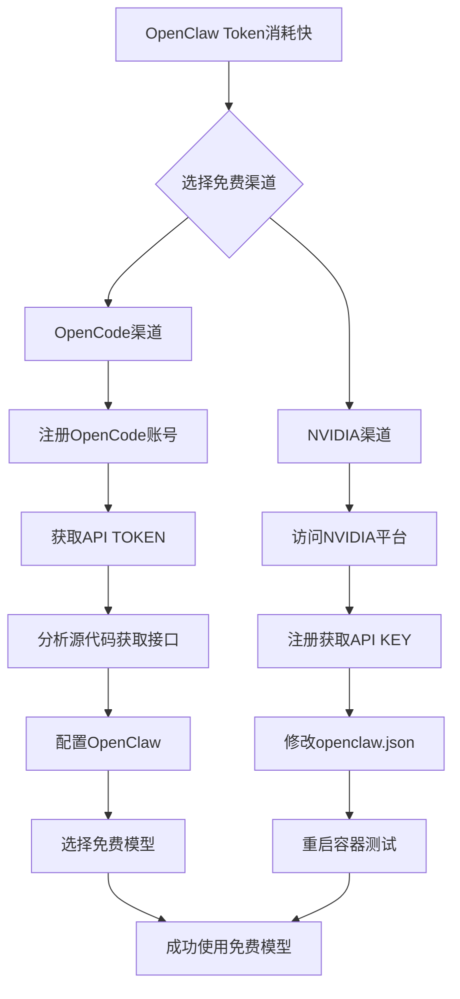

# OpenClaw免费AI模型配置指南

## 文章信息
- **标题**: 【建议收藏】OpenClaw太烧钱？解锁这2个隐藏渠道，Token无限免费用！
- **作者**: Hellos AI杰哥
- **来源**: 微信公众号"Hellos AI"
- **发布时间**: 未明确（2026-03-04访问）
- **原文链接**: https://mp.weixin.qq.com/s/Rvql91RKaQNErqywZXF7gA
- **作者博客**: https://hellosai.cc/

## 核心问题与解决方案

### 问题背景
OpenClaw使用过程中Token消耗快，成本较高。

### 解决方案概览
文章介绍了两个免费使用AI模型的渠道，可以有效降低OpenClaw使用成本。

---

## 渠道一：OpenCode

### 基本介绍
- **性质**: 开源编程工具（类似Claude Code的编码工具）
- **特点**: 提供多个免费AI模型
- **访问方式**: 需要获取API访问权限

### 可用免费模型
1. **MiniMax M2.5** - 国产大模型，社区推荐
2. **Big Pickle** - 免费模型
3. **Kimi K2.5 Free** - 国产大模型，社区推荐

> **社区评价**: 在油管、Reddit上，Kimi2.5和MiniMax是OpenClaw玩家推荐较多的国产模型。

### 配置步骤

#### 1. 获取API访问权限
```bash
# 1. 注册OpenCode账号
# 访问OpenCode官网注册

# 2. 获取TOKEN
# 注册后可以在账号设置中获取API TOKEN
```

#### 2. 分析API接口（通过源代码）
```python
# OpenCode是开源项目，可以通过分析源代码获取API信息
# 使用antigravity分析代码后得到的API接口：
https://opencode.ai/zen/v1/chat/completions
```

#### 3. TOKEN管理策略
- 单个账号额度受限时，可以注册多个账号
- 使用多个TOKEN循环使用
- 在Postman中测试API接口

#### 4. OpenClaw配置
```bash
# 在OpenClaw中配置OpenCode
# 选择免费模型（MiniMax M2.5或Kimi K2.5 Free）
# 设置对应的TOKEN
```

---

## 渠道二：英伟达(NVIDIA)

### 基本介绍
- **平台**: NVIDIA AI Playground
- **网址**: https://build.nvidia.com/models
- **特点**: 提供NVIDIA自家的免费AI模型
- **认证**: 需要注册获取API KEY

### 配置步骤

#### 1. 注册与获取API KEY
1. 访问 https://build.nvidia.com/models
2. 点击右上角"Login"进行注册
3. 登录后选择"API KEYS"
4. 在页面中添加新的API KEY

#### 2. OpenClaw配置
```json
// 在openclaw.json中手动修改配置
{
  "PROVIDER": {
    // NVIDIA相关配置
  }
}
```

#### 3. 重启与测试
1. 修改配置后需要重启OpenClaw容器
2. 进行API调用测试验证配置是否成功

---

## 模型选择建议

### 免费模型（推荐）
- **MiniMax M2.5** - 性能稳定，社区认可度高
- **Kimi K2.5 Free** - 国产优秀模型，中文理解好

### 付费模型（不计成本时）
- **Claude系列顶级模型** - 更聪明、智能，但Token消耗大
- 适合对质量要求极高的场景

---

## 关键知识点

### 1. Token管理
- **问题**: OpenClaw Token消耗快
- **解决方案**: 使用免费模型渠道降低成本
- **扩展策略**: 多账号循环使用TOKEN

### 2. API配置原理
- **开源工具优势**: 可以通过分析源代码了解API接口
- **API测试**: 使用Postman等工具预先测试API可用性
- **配置验证**: 修改配置后必须重启服务并测试

### 3. 社区资源利用
- **信息源**: 油管、Reddit等平台有丰富的OpenClaw使用经验分享
- **模型推荐**: 关注社区推荐的稳定免费模型
- **问题解决**: 参考其他用户的配置经验

---

## 操作流程图



---

## 重要提醒

### 注意事项
1. **账号安全**: 妥善保管API TOKEN和KEY
2. **服务条款**: 遵守各平台的使用条款和限制
3. **额度限制**: 免费模型通常有调用频率或总量限制
4. **稳定性**: 免费服务的稳定性可能不如付费服务

### 故障排除
1. **API不可用**: 检查TOKEN是否有效，网络是否连通
2. **配置错误**: 验证配置文件格式，检查关键参数
3. **服务重启**: 配置修改后必须重启相关服务
4. **社区求助**: 遇到问题可以在相关社区寻求帮助

---

## 相关资源链接

### 官方平台
- OpenCode官网: （文中未提供具体网址）
- NVIDIA AI Playground: https://build.nvidia.com/models
- OpenClaw官方: https://docs.openclaw.ai

### 社区资源
- YouTube: OpenClaw使用教程
- Reddit: OpenClaw讨论区
- 作者博客: https://hellosai.cc/

### 测试工具
- Postman: API测试工具
- curl: 命令行API测试

---

## 标签系统（Obsidian使用）

```yaml
tags:
  - AI/OpenClaw
  - 免费资源
  - API配置
  - 成本优化
  - 工具教程
  - AI模型
```

### 双向链接建议
- [[OpenClaw使用指南]]
- [[AI模型免费资源]]
- [[API配置技巧]]
- [[开源工具分析]]
- [[成本管理策略]]

---

## 总结

这篇文章提供了两个实用的OpenClaw免费AI模型配置方案：
1. **OpenCode** - 通过开源工具获取免费模型访问权限
2. **NVIDIA** - 利用英伟达官方平台提供免费AI服务

两种方案各有特点，用户可以根据自己的技术水平和需求选择适合的方案。关键是要理解API配置原理，善用社区资源，并注意免费服务的限制条件。

> **最后建议**: 对于注重稳定性和性能的场景，仍可考虑使用Claude等付费模型；对于学习和日常使用，免费模型是完全可行的选择。
```