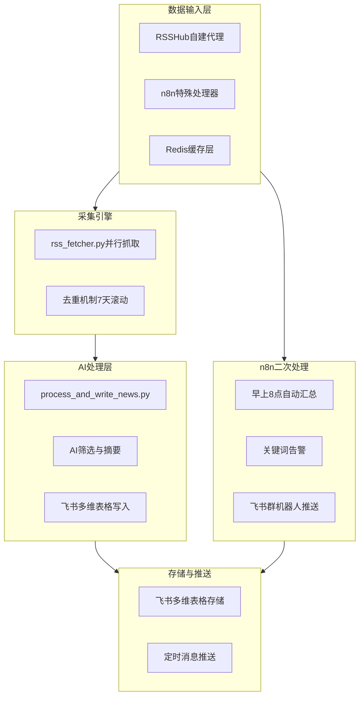

# 🛠️ OpenClaw+n8n情报监控系统搭建指南

## 📋 原文信息
- **标题**: 我用OpenClaw+n8n搭了一套情报监控系统，朋友以为我买了年费会员
- **来源**: 微信公众号"脉路"
- **原文链接**: https://mp.weixin.qq.com/s/aFe3LN0gxIu5TcDp8_BcqQ?scene=1
- **处理时间**: 2026-03-04 01:52 GMT+8
- **适合读者**: 中级技术用户，熟悉OpenClaw基础操作

## 📖 内容摘要

这篇文章详细介绍了如何利用**OpenClaw**和**n8n**构建一个完全免费的行业情报监控系统。系统核心功能包括：

### 🎯 解决的核心问题
- 信息过载：公众号太多看不完
- 时间浪费：刷资讯容易分心
- 跟踪困难：手动搜索竞品动态费时
- 信息焦虑：担心错过重要行业信息

### 🏗️ 系统架构


### 💰 成本优势
- **完全免费**：使用开源工具和免费模型
- **开源可定制**：所有代码可自行修改
- **模型推荐**：MiniMax或GLM等包月套餐（便宜管饱）

## 📚 详细知识结构

### 1. 系统核心理念
- **定时器 (Trigger)**: 驱动任务循环
- **AI大脑 (Processor)**: 内容深度筛选与智能格式化
- **飞书通道 (Output)**: 最终触达与协作界面

### 2. 数据输入策略
- **RSS为主，多元辅助**
- **RSSHub自建代理**: 将Twitter、YouTube、GitHub等非标平台转为RSS
- **n8n特殊处理器**: 处理高难度、非结构化数据（如YouTube元数据）
- **Redis缓存层**: 加速RSSHub，规避限流风险

### 3. 核心组件详解

#### 🔧 rss_fetcher.py（采集引擎）
- 并行抓取所有RSS/API
- 3次指数退避重试机制
- 7天滚动去重（SHA256(title+link)哈希）
- 支持分层抓取（tier1-3）
- 输出：memory/rss_latest.json

#### 🤖 process_and_write_news.py（处理器）
- 调用AI进行内容筛选和摘要
- 对英文源自动翻译
- 按重要性排序：必看、速览、GitHub项目、大佬博客
- 生成飞书富文本消息格式
- 写入飞书多维表格并推送

#### 🧹 cleanup_bitable_news.py（清理器）
- 清理7天前的旧记录
- 维护rss_cache.json去重缓存
- 支持dry-run模式

### 4. 10步搭建流程

#### Step 1 — 部署自建RSSHub
```bash
# 创建infra/rsshub/docker-compose.yml
# RSSHub端口1200，Redis 7 Alpine缓存
# 配置ACCESS_KEY访问控制
```

#### Step 2 — 创建飞书多维表格
- 表格名称："热点新闻存档"
- 字段设计：标题、来源、分类、链接、摘要、抓取时间
- 记录app_token、table_id到feishu/BITABLE_CONFIG.md

#### Step 3 — 配置RSS订阅源清单
- 文件：news/RSS_FEEDS.md
- 分类组织：AI/人工智能、社交媒体/大佬动态、YouTube、科技综合等
- 总源数目标100+个

#### Step 4 — 编写RSS采集引擎
- 从RSS_FEEDS.md自动解析所有源
- ThreadPoolExecutor并行抓取（20线程）
- 支持--tier参数分层抓取

#### Step 5 — 编写AI处理+飞书写入脚本
- 读取rss_latest.json
- AI筛选最有价值的新闻
- 生成中文摘要（英文翻译）
- 写入飞书多维表格并推送

#### Step 6 — 编写数据清理脚本
- 清理7天前的记录
- 清理过期的去重缓存
- 打印清理统计

#### Step 7 — 端到端测试验证
- 验证完整数据流
- 测试去重功能
- 检查错误处理

#### Step 8 — 配置定时任务
```cron
# 每小时热点
0 * * * * rss_fetcher.py --tier tier1 --hours 2

# 早报09:00
0 9 * * * rss_fetcher.py && process_and_write_news.py --mode morning

# 午报14:00  
0 14 * * * rss_fetcher.py && process_and_write_news.py --mode noon

# 晚报20:00
0 20 * * * rss_fetcher.py && process_and_write_news.py --mode evening

# 每日清理03:00
0 3 * * * cleanup_bitable_news.py
```

#### Step 9 — 文档整理与归档
- 更新所有配置文件
- 创建系统架构说明
- 推送到GitHub仓库

#### Step 10 — 监控与优化（可选）
- 运行监控和性能优化
- 失败告警机制
- 源健康检查

### 5. 高质量RSS源推荐

#### AI/科技赛道
- 36氪：https://www.36kr.com/feed
- 极客公园：https://www.geekpark.net/feed  
- AIpresso（AI资讯）：https://aipresso.com/feed
- Hacker News：https://hnrss.org/frontpage

#### 建议原则
- 先从5-10个源开始
- 源的质量 > 数量
- 定期优化和调整

## 🛡️ 避坑指南（作者亲测经验）

### 1. 飞书API限制
- 免费版飞书有API调用频率限制
- 建议：分批同步，避免触发限流

### 2. 源的质量管理
- 作者经验：从几十个源删到15个效率更高
- 关键：持续优化信息源

### 3. 系统持续使用
- 工具建好不用等于没建
- 每天早中晚三次推送，保持接触

### 4. OpenClaw使用注意事项
- 第一次搭建好后建议拍快照或设置回滚规则
- 建议使用子代理模式运行任务
- 可配合MemOS实现多agent使用

## 🚀 实践建议

### 1. 起步建议
1. **从简单开始**：先部署RSSHub和基础抓取
2. **测试单源**：验证单个RSS源的全流程
3. **逐步扩展**：成功后再添加更多源

### 2. 定制化方向
- **行业定制**：根据关注行业调整RSS源
- **推送优化**：调整推送时间和频率
- **AI模型**：尝试不同模型的效果

### 3. 维护策略
- **每周检查**：源的健康状态
- **每月优化**：调整源清单
- **季度升级**：系统架构改进

## 🔗 相关技术栈

### 核心工具
- **OpenClaw**：AI处理和自动化引擎
- **n8n**：工作流编排和二次处理
- **RSSHub**：RSS转换服务
- **飞书**：存储和推送通道
- **Redis**：缓存加速

### 编程语言
- **Python**：核心脚本（rss_fetcher.py等）
- **Docker**：RSSHub容器部署
- **Markdown**：配置文档

### AI模型推荐
- **MiniMax**：性价比高，中文理解好
- **GLM**：国产优秀模型
- **Claude**：性能优秀但成本较高

## 📊 预期效果

### 时间节省
- **每日**：节省30-60分钟手动搜索时间
- **每周**：系统化整理行业动态
- **每月**：建立个人行业情报库

### 信息质量
- **筛选效率**：AI自动筛选重要内容
- **覆盖广度**：100+信息源全面覆盖
- **深度分析**：AI摘要和分类整理

### 知识积累
- **结构化存储**：飞书多维表格长期存档
- **易于检索**：分类明确的新闻数据库
- **持续学习**：基于历史数据的趋势分析

## 🏆 成功关键因素

### 1. 系统思维
> "信息收集的终极问题不是「工具」，而是「系统」。"

### 2. 持续优化
- 对信息源的持续优化
- 对表格结构的不断迭代
- 对情报的主动消费习惯

### 3. 价值导向
- 工具免费，但注意力值钱
- 把省下的时间用于深度思考
- 关注真正重要的事情

## 🏷️ 标签系统

```yaml
tags:
  - AI/OpenClaw
  - 自动化系统
  - 情报监控
  - RSS收集
  - n8n工作流
  - 飞书集成
  - Python脚本
  - 定时任务
  - 免费工具
  - 信息管理
```

## 🔗 双向链接建议

### 关联学习笔记
- [[OpenClaw-Free-Models-Guide]] - OpenClaw免费模型配置
- [[学习区索引]] - 查看其他AI学习内容
- [[工具使用]] - 更多工具学习笔记

### 项目实践
- [[项目索引]] - 可将此作为个人项目启动
- [[产出区]] - 基于此系统产出行业分析报告

### 知识扩展
- [[RSS技术]] - 深入了解RSS协议和应用
- [[自动化运维]] - 系统监控和维护知识
- [[信息架构]] - 信息组织和分类方法

## 📝 学习收获总结

### 技术层面
1. **系统架构设计**：学习分层架构和模块化设计
2. **自动化流水线**：掌握完整的数据处理流水线
3. **多工具集成**：实践多种工具的组合使用

### 实践层面
1. **问题解决**：从需求分析到方案实施的全过程
2. **持续优化**：建立系统迭代和改进的思维
3. **价值创造**：将技术转化为实际生产力

### 思维层面
1. **系统思维**：从整体角度设计解决方案
2. **效率思维**：用自动化解放人工劳动
3. **成长思维**：建立持续学习和改进的习惯

---

> **最终建议**：不要追求完美，从最小可行系统开始，在实践中不断迭代和优化。真正的价值不在于工具本身，而在于你如何使用它来解决实际问题。
